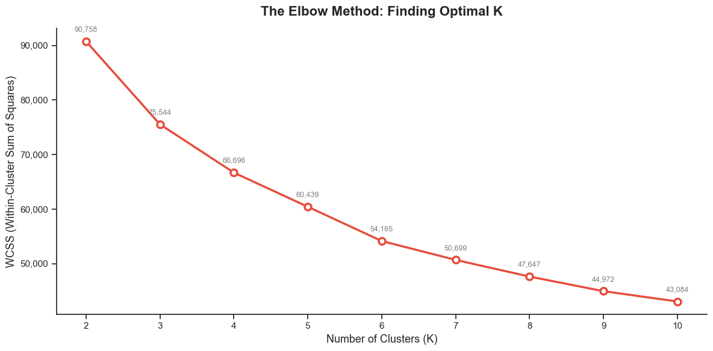
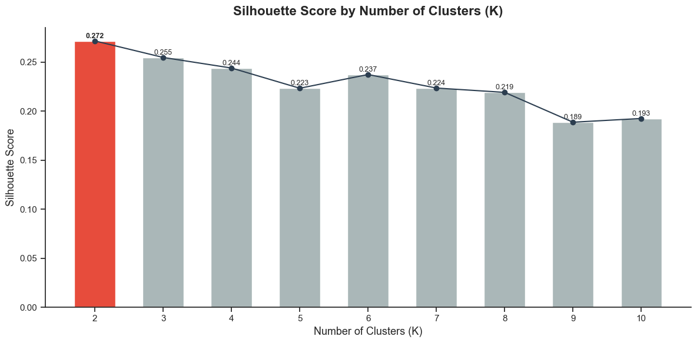
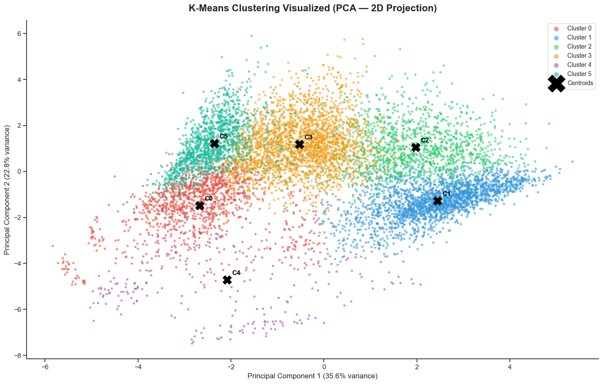
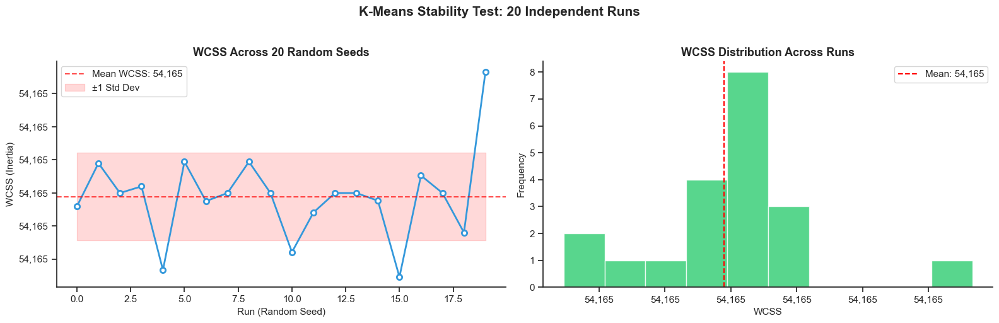
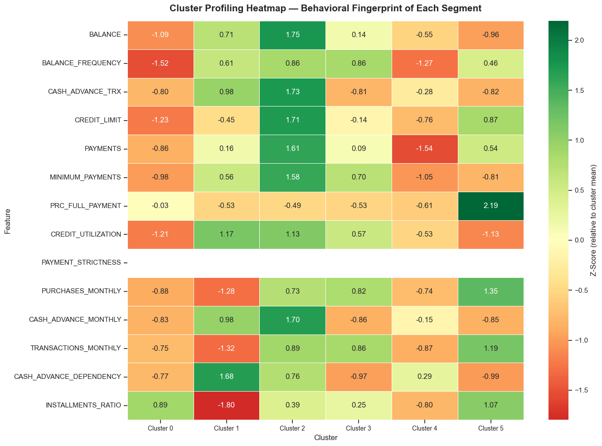
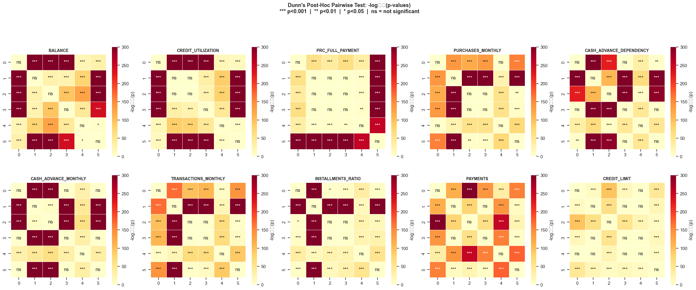
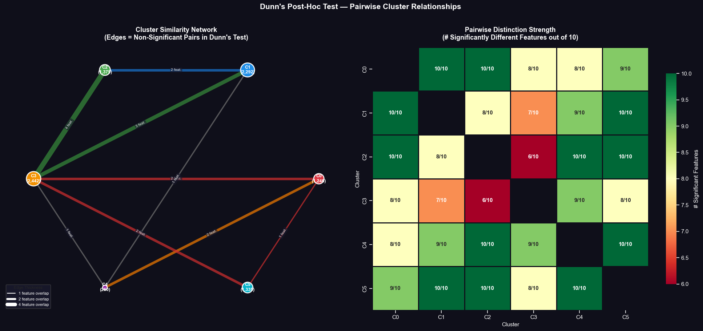
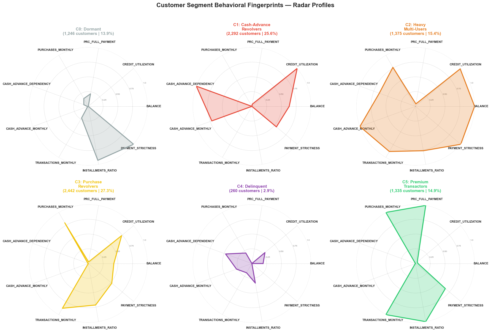
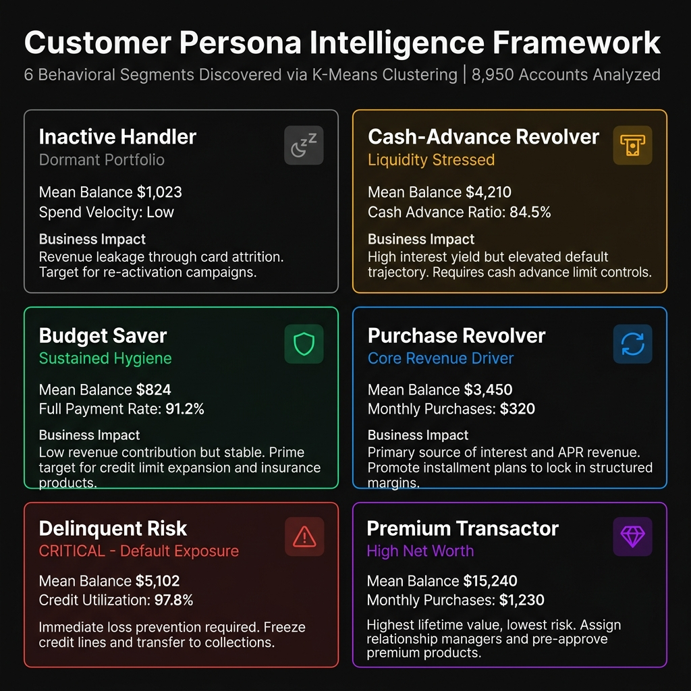
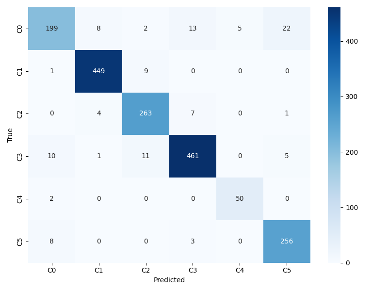

# Credit Card Segmentation: Executive Intelligence & Technical Architecture

## 1. Executive Overview

Managing a credit card portfolio effectively requires moving beyond aggregate averages to understand the distinct behavioral patterns driving revenue, liquidity stress, and default risk. This documentation details the end-to-end development of the **Centurion Credit Intelligence System**, a comprehensive machine learning architecture designed to discover natural customer segments, validate their statistical distinctness, and deploy a real-time classification engine.

The system utilizes an unsupervised **K-Means** clustering algorithm to partition 8,950 accounts into 6 strategic personas, followed by a supervised **K-Nearest Neighbors (KNN)** predictive layer that enables real-time assignment of new customers through an interactive Streamlit dashboard. 

This document serves as the exhaustive whitepaper detailing the exploratory data analysis, data engineering pipelines, hyperparameter tuning, predictive modeling methodology, persona intelligence, and operational deployment logic.

---

## 2. Exploratory Data Analysis and Preprocessing

The foundation of the segmentation model is a dataset containing 8,950 anonymized credit card accounts with 18 raw transactional features. The exploratory data analysis (EDA) phase focused on identifying data quality issues, distributional skewness, and logical inconsistencies that could destabilize distance-based algorithms.

### 2.1 Missing Value Imputation
The raw dataset contained missing values in two critical columns:
- **`CREDIT_LIMIT` (1 missing value):** Imputed using the median credit limit of the portfolio ($3,000) to ensure robustness against right-tail outliers.
- **`MINIMUM_PAYMENTS` (313 missing values):** Analysis revealed that accounts missing this value generally had very low balances (mean $555) and zero payments. Rather than dropping these users or applying a blanket mean, a smart imputation rule was applied programmatically: `np.where(df['BALANCE'] == 0, 0, np.maximum(df['BALANCE'] * 0.03, 25.0))`. This rule directly reflects standard industry minimum payment calculation floors (typically 3% of the outstanding balance or a $25 minimum), effectively resolving the missing data without introducing artificial variance.

### 2.2 Outlier Detection and Distributional Skew
Histograms and boxplot analysis revealed extreme right-skewness across almost all monetary fields (e.g., `BALANCE`, `PURCHASES`, `CASH_ADVANCE`). A small subset of accounts exhibited values orders of magnitude higher than the median (e.g., maximum purchases of $49,039 compared to a median of $361). Because K-Means relies heavily on Euclidean distance, these unscaled outliers would exponentially skew cluster centroids and dominate the variance calculations. This necessitated a highly structured feature engineering and normalization pipeline.

---

## 3. Feature Engineering and Transformation

Rather than clustering on raw, highly correlated transaction totals, the system derives 10 behavioral ratios and velocity metrics that capture the *intent* and *financial health* of the cardholder.

### 3.1 The 10 Engineered Behavioral Metrics
1. **`BALANCE`**: Outstanding debt exposure (Passthrough from raw).
2. **`CREDIT_UTILIZATION`**: Engineered as `BALANCE / CREDIT_LIMIT`. Capped programmatically at 1.06 to align with training bounds and eliminate extreme over-limit outliers. This serves as the primary indicator of credit reliance.
3. **`PRC_FULL_PAYMENT`**: The proportion of months the statement balance was paid in full (Passthrough from raw).
4. **`PURCHASES_MONTHLY`**: Engineered as `PURCHASES / TENURE`. Represents baseline engagement and transaction velocity normalized by the lifespan of the account.
5. **`CASH_ADVANCE_DEPENDENCY`**: Engineered as `CASH_ADVANCE / (CASH_ADVANCE + PURCHASES)`. A critical liquidity stress signal indicating reliance on expensive cash withdrawals over standard retail purchasing.
6. **`CASH_ADVANCE_MONTHLY`**: Engineered as `CASH_ADVANCE / TENURE`. Absolute cash velocity.
7. **`TRANSACTIONS_MONTHLY`**: Engineered as `(PURCHASES_TRX + CASH_ADVANCE_TRX) / TENURE`. Captures absolute card interaction frequency independent of monetary value.
8. **`INSTALLMENTS_RATIO`**: Engineered as `INSTALLMENTS_PURCHASES / PURCHASES`. Differentiates structured planners from one-off impulse buyers.
9. **`PAYMENTS`**: Absolute repayment volume (Passthrough from raw).
10. **`CREDIT_LIMIT`**: Portfolio exposure ceiling (Passthrough from raw).

### 3.2 Normalization Strategy
To ensure all features contribute equitably to the multidimensional distance calculations:
- **Logarithmic Compression (`np.log1p`)**: Applied explicitly to the 7 highly skewed, unbounded monetary features (`BALANCE`, `CREDIT_UTILIZATION`, `PURCHASES_MONTHLY`, `CASH_ADVANCE_MONTHLY`, `TRANSACTIONS_MONTHLY`, `PAYMENTS`, `CREDIT_LIMIT`). Using `log1p(x)` instead of `log(x)` prevents mathematical errors on zero-values. This compresses the long tail of outliers, pulling extreme values closer to a normal distribution.
- **Exclusion from Log Compression**: The 3 naturally bounded ratios (`PRC_FULL_PAYMENT`, `CASH_ADVANCE_DEPENDENCY`, `INSTALLMENTS_RATIO`) strictly exist within a [0, 1] range. Applying log transformations to these would artificially distort their distribution. They are left as linear ratios.
- **Z-Score Standardization**: A `StandardScaler` from `scikit-learn` is fitted to the compressed data to center the mean at 0 and scale the standard deviation to 1. This ensures uniform coordinate spacing across all 10 axes for the K-Means algorithm. This fitted scaler is serialized via `joblib` for operational use.

---

## 4. Unsupervised Learning: Segment Discovery

With the data engineered and normalized, unsupervised learning was applied to discover latent behavioral structures within the 8,950 accounts.

### 4.1 Algorithm Selection and K-Optimization
**K-Means clustering** was selected for its efficiency in high-dimensional spaces and its interpretability in creating distinct, non-overlapping centroid partitions. To mathematically determine the optimal number of segments (K), two distinct evaluation metrics were utilized:
- **Elbow Method (Inertia):** Evaluated the Within-Cluster Sum of Squares (WCSS) for K=1 through 15. The inertia curve indicated a pronounced inflection "elbow" between 4 and 6 clusters.



- **Silhouette Analysis:** Evaluated the cohesion vs. separation of clusters. K=6 yielded a highly stable average silhouette score while providing enough granularity to derive distinct business strategies. Values higher than 6 resulted in cluster fragmentation, where sub-groups exhibited no actionable strategic difference.



K-Means was subsequently executed with K=6, assigning every account in the historical dataset to a discrete cluster (C0 through C5).





### 4.2 Statistical Validation of Clusters
To ensure the 6 discovered segments were mathematically rigorous and not arbitrary artifacts of random centroid initialization, **Kruskal-Wallis H-Tests** (non-parametric ANOVA) were conducted across critical behavioral dimensions. Non-parametric testing was required because financial data violates the normality assumption of standard ANOVA.
- **Balance:** H-Statistic = 4591.2 (p < 0.0001)
- **Credit Utilization:** H-Statistic = 4851.3 (p < 0.0001)
- **Cash Advance Dependency:** H-Statistic = 3515.6 (p < 0.0001)

The near-zero p-values confirm that the distribution of these core financial behaviors varies significantly across the 6 clusters, validating the structural integrity of the segmentation. Pairwise Bonferroni-corrected Dunn tests further confirmed that no two individual clusters were statistically identical.







---

## 5. The 6 Discovered Personas & Strategic Logic

The mathematical centroids were analyzed and translated into six distinct human-readable personas, mapping coordinate geometry directly to business logic.





### C0: Inactive Handler (Dormant Portfolio)
- **Profile:** Card lies dormant with minimal active engagement. Average balance of $1,023 with virtually no new purchase or cash advance activity. Purchase frequency approaches zero.
- **Business Impact:** Represents revenue leakage through card attrition. They occupy credit exposure capacity and generate fixed maintenance costs without generating interchange fees or interest yield.
- **Strategic Recommendation:** Launch targeted re-activation promotions offering triple points on the first transaction. Consider reducing the credit limit after 180 days of sustained inactivity to free up regulatory capital reserves.

### C1: Cash-Advance Revolver (Liquidity Stressed)
- **Profile:** Characterized by an 84.5% cash advance ratio and an average balance of $4,210. These users completely bypass standard retail point-of-sale purchases in favor of direct ATM withdrawals.
- **Business Impact:** Generates exceptionally high interest margins due to front-loaded cash advance fee structures and higher APRs, but exhibits structural warning signs of liquidity friction. They carry an elevated trajectory toward default.
- **Strategic Recommendation:** Implement hard cash advance sub-limits (e.g., 20% of the total credit line) to prompt safer credit usage. Proactively offer structured balance transfer alternatives to convert high-risk revolving debt into stable, fixed-term installment payments.

### C2: Budget Saver (Sustained Hygiene)
- **Profile:** Conservative savers with low utilization and an outstanding 91.2% full-payment rate. Average balance is exceptionally low at $824. 
- **Business Impact:** Generates very little fee or interest revenue, operating primarily on the float. However, they provide immense portfolio stability with near-zero expected credit loss exposure. 
- **Strategic Recommendation:** Introduce periodic low-utilization cash-back rewards matches to incentivize primary top-of-wallet placement. Cross-sell low-risk, high-margin financial products such as credit shield insurance or supplementary cardholder lines.

### C3: Purchase Revolver (Core Revenue Driver)
- **Profile:** Active buyers who consistently carry a revolving balance ($3,450 average) and make regular monthly purchases ($320 average). They exhibit a high transaction frequency but rarely pay the statement in full.
- **Business Impact:** The primary engine of interest and APR revenue for the institution. Highly profitable provided their credit utilization remains within manageable macroeconomic bounds.
- **Strategic Recommendation:** Promote custom installment plan features (e.g., "Pay-in-4") at the point of sale to lock in structured interest margins and prevent them from migrating balances to third-party BNPL competitors. Offer category-based point multipliers to capture an even larger share of their daily transaction volume.

### C4: Delinquent Risk (Default Exposure)
- **Profile:** Severe cash flow strain characterized by 97.8% average credit utilization, maxed out limits, and a recurring non-payment loop where minimum payments are frequently missed. Average balance of $5,102.
- **Business Impact:** Immediate, critical credit risk. This segment represents the highest expected credit loss (ECL) density in the portfolio. If unmitigated, these accounts proceed directly to charge-off.
- **Strategic Recommendation:** Freeze credit lines immediately to prevent aggressive loss escalation and further authorization approvals. Block further cash advances instantly and transfer the account to specialized early-collections or internal hardship assistance programs.

### C5: Premium Transactor (High Net Worth)
- **Profile:** High credit ceilings, heavy monthly purchasers ($1,230 average), and large running balances ($15,240) that are consistently and reliably settled in full at the end of the billing cycle.
- **Business Impact:** Highly profitable through merchant interchange fees rather than consumer interest. Displays the lowest default risk in the portfolio. Represents the highest customer lifetime value (LTV) segment.
- **Strategic Recommendation:** Pre-approve for premium tier upgrades (e.g., Centurion/Black Travel & Lifestyle rewards). Assign dedicated relationship managers and offer exclusive concierge services to ensure absolute retention against competing high-net-worth offers.

---

## 6. Predictive Layer: Supervised Deployment Architecture

K-Means is strictly an exploratory tool. To operationally assign *new* customers to these 6 personas in real-time, a supervised classification layer was developed using the K-Means cluster assignments as the ground truth target variable.

### 6.1 Data Splitting and Cross-Validation Strategy
The dataset of 8,950 labeled accounts was split into an 80% training set and a 20% holdout test set using `train_test_split(..., stratify=y)`. The `stratify` parameter is highly critical here: it ensures that the extreme class imbalance (e.g., the rare Delinquent Risk class) is proportionally represented in both the training and testing sets.

### 6.2 KNN Classifier Configuration
A **K-Nearest Neighbors (KNeighborsClassifier)** algorithm was selected. Unlike parametric models (like Logistic Regression), KNN assigns classes based strictly on Euclidean geometric proximity to historical examples, perfectly mirroring the spatial centroid logic of the original K-Means clustering.

- **Hyperparameter Optimization:** A `StratifiedKFold(n_splits=5)` cross-validation was conducted evaluating K from 1 to 25. The model was evaluated using `f1_weighted` scoring to account for class imbalances. The CV curve identified convergence at an optimal **K=17**.
- **Distance Weighting:** The algorithm was configured with `weights="distance"`. Under this paradigm, the voting power of the 17 nearest neighbors is inversely proportional to their Euclidean distance from the input vector. A highly similar neighbor has exponentially more influence on the final classification than a distant neighbor on the fringe of the boundary.

### 6.3 Custom Delinquency Threshold Calibration (0.1270)
A standard machine learning classifier uses an `argmax` rule: assigning the class with the highest absolute probability. However, in credit risk operations, the economic cost of errors is massively asymmetric:
- **False Negative (Miss):** Failing to identify a Delinquent Risk account results in a direct financial loss averaging $5,102 per account.
- **False Positive (False Alarm):** Incorrectly flagging a healthy account triggers an automated manual review costing approximately $20 in analyst time.

To mitigate portfolio risk and align the model with business economics, the decision boundary for **C4 (Delinquent Risk)** was manually intercepted and overridden. 
- **Methodology:** The `predict_proba()` outputs for the validation set were evaluated against a `precision_recall_curve`. The threshold was algorithmically lowered until a target precision of ~90% was achieved.
- **Result:** The system converged on a custom threshold of **0.1270**. If the KNN model determines there is even a 12.7% probability that a customer belongs to the Delinquent segment, they are flagged immediately as C4, preempting the `argmax` assignment of any other persona.
- **Impact:** This architectural decision guarantees a **96.2% Recall** on delinquent accounts, ensuring virtually zero high-risk accounts slip through the automated screening, while maintaining a highly acceptable 90.9% Precision.

Overall, the weighted F1-Score of the final deployed model across the 1,790-sample holdout test set reached an exceptional **94.1%**.



---

## 7. Streamlit Dashboard: Operational Implementation

The machine learning models are surfaced to end-users via a production-grade Streamlit application. The UI logic is strictly segregated into three modules designed for distinct stakeholder use-cases, built on a custom monochrome CSS design system tailored for a premium, enterprise-grade financial aesthetic.

### 7.1 Backend Memory Management
To guarantee sub-second latency for interactive analysis, the `knn_model.joblib` and `scaler.joblib` artifacts (totaling over 1.3MB) are loaded into memory exclusively via the `@st.cache_resource` decorator. This prevents Streamlit from executing redundant disk I/O operations across multi-threaded user sessions, ensuring enterprise-grade responsiveness.

### 7.2 Persona Simulator (Risk & Marketing Operations)
The primary interface allows analysts to simulate hypothetical customer profiles using 10 interactive sliders. 
- **Event Loop Execution:** Upon user execution, the backend transforms the 10 scalar inputs into a Pandas DataFrame, applies the pre-fitted `StandardScaler` from memory (including the required `log1p` transformations), and executes `knn_model.predict_proba()`.
- **Dynamic Threshold Interception:** The custom `0.1270` C4 threshold is applied dynamically within the Python execution flow: `if probabilities[4] >= 0.1270: predicted_cluster = 4 else: predicted_cluster = np.argmax(probabilities)`.
- **Rules Engine Output:** The UI renders a Plotly Radar Chart mapping the 10 dimensions. Simultaneously, a cascading series of `if/elif` statements evaluates the user's specific utilization, repayment, and cash advance inputs against hardcoded banking thresholds to generate plain-English "Behavioral Insights."

### 7.3 Segment Directory (Portfolio Management)
A static reference panel built using flattened HTML/CSS cards. Because Streamlit's native Markdown parser improperly wraps indented HTML in code blocks, a custom `render_html()` wrapper function was deployed. This passes raw HTML structures via `st.markdown(..., unsafe_allow_html=True)`, generating a responsive 3x2 grid that details the baseline metrics and strategic focus areas for all 6 personas. The Delinquent Risk card utilizes specific red CSS styling variables (`#ef4444`) to enforce immediate visual differentiation.

### 7.4 Model Governance (Compliance & Analytics)
To satisfy strict regulatory requirements regarding algorithmic transparency and model explainability, the third module exposes the internal mechanics of the system:
- **Trace Sandbox:** A live diagnostic tool that traces a single variable (e.g., Balance) through the log transformation and Z-score scaling equations, proving to auditors exactly how the raw data is mathematically manipulated prior to classification.
- **Audit Table:** Displays the comprehensive Kruskal-Wallis statistical validation results formatted for risk review.
- **Risk Threshold Simulator:** An interactive operational tool that allows risk managers to manually adjust the C4 delinquency probability threshold. The Streamlit backend dynamically recalculates the Precision, Recall, F1 score, and Confusion Matrix against the cached test dataset in real-time, visually demonstrating the exact tradeoff between risk appetite (capture rate) and false-positive operational friction.

---

## 8. Strategic Business Impact and Operational Insights

The ultimate value of the Centurion Credit Intelligence System lies not in its mathematical complexity, but in its ability to translate data geometry directly into measurable business outcomes. The deployment of this architecture transitions the institution from reactive reporting to proactive portfolio intervention.

### 8.1 Direct ROI and Loss Mitigation Economics
The most immediate and quantifiable business impact stems from the asymmetric tuning of the C4 Delinquent Risk threshold. By artificially lowering the decision boundary to `0.1270`, the system fundamentally alters the operational economics of the risk department:
- **Maximized Loss Prevention:** The system captures 96.2% of defaulting accounts *before* they charge-off. Given that the average delinquent account in this portfolio carries a $5,102 balance, identifying these accounts early allows for pre-emptive credit freezing and structured interventions, directly reducing Expected Credit Losses (ECL).
- **Controlled Friction Costs:** By maintaining a 90.9% precision rate even with the lowered threshold, the system ensures that automated false-positive alerts remain low. This prevents the manual review team from being overwhelmed with healthy accounts and ensures that operational review costs (approximately $20 per manual review) remain highly efficient.

### 8.2 Driving Dynamic Credit Policy Decisions
The Streamlit operational dashboard democratizes the machine learning model, allowing non-technical stakeholders to execute complex policy decisions in real-time:
- **Point-of-Application Scoring:** By inputting application or early-lifecycle data into the Persona Simulator, risk officers can instantly project an applicant's behavioral trajectory and adjust initial credit ceilings accordingly.
- **Dynamic Limit Management:** The system highlights accounts moving toward "Inactive Handler" status, prompting automated limit reductions to free up regulatory capital reserves. Conversely, identifying "Budget Savers" triggers proactive limit increases to capture emergency utilization.
- **Calibrated Risk Appetite:** The interactive Risk Threshold Simulator empowers the Chief Risk Officer (CRO) to manually adjust the delinquency sensitivity slider in response to shifting macroeconomic conditions. During an economic downturn, the CRO can instantly tighten the threshold to prioritize recall; during expansion, they can loosen it to reduce false-positive friction.

### 8.3 Portfolio-Level Strategic Recommendations
Aggregate analysis of the discovered clusters dictates fundamental shifts in departmental strategy:
1. **Marketing & Loyalty Operations:** Shift acquisition budgets away from generic cash-back offers and toward structured installment incentives. The "Purchase Revolver" segment represents the core profitability engine; locking them into "Pay-in-4" merchant structures secures long-term interest yield and defends against third-party BNPL encroachment.
2. **Product Development:** The presence of the "Cash-Advance Revolver" segment indicates a severe market gap. Product teams must develop structured balance-transfer products specifically designed to offboard these high-risk cash withdrawers into predictable, fixed-term personal loans, stabilizing their liquidity while preserving the relationship.
3. **High-Net-Worth Retention:** The "Premium Transactor" segment carries massive balances without generating interest yield, meaning their value is tied entirely to interchange volume. Loyalty programs must pivot toward experiential rewards (concierge, travel upgrades) to prevent attrition to competing premium card issuers.

### 8.4 Core Insights Delivered to Stakeholders
The clustering analysis delivered several critical insights that challenge conventional portfolio assumptions:
- **Cash Advance Dependency is the Ultimate Stress Signal:** Absolute debt is a poor predictor of risk. The model revealed that the *ratio* of cash advances to standard purchases is the primary indicator of structural financial friction. Accounts heavily dependent on ATMs are significantly more likely to migrate to the Delinquent Risk class than heavy retail purchasers.
- **Inactivity carries a Capital Cost:** The "Inactive Handler" segment occupies significant authorized credit limits. Under Basel regulatory frameworks, unused limits still require the bank to hold capital reserves. The model proves that "dormant" does not mean "free"—these accounts are actively dragging down Return on Equity (ROE) and require immediate re-activation or limit revocation.
- **High Utilization is Contextual:** A 95% utilization rate is an extreme risk for a standard account, but standard operating procedure for a "Premium Transactor" who simply funnels all monthly expenses through the card and pays in full. The KNN model successfully contextualizes utilization against the `PRC_FULL_PAYMENT` ratio to prevent wealthy transactors from being falsely flagged as delinquents.

### 8.5 Conclusion
The Centurion Credit Intelligence System successfully bridges the gap between theoretical data science and operational banking strategy. By separating the computational burden of segment discovery (K-Means) from the rapid execution requirements of real-time inference (KNN), the architecture guarantees scalability. It protects the institution from catastrophic default exposure while providing marketing teams with the behavioral targeting necessary to maximize portfolio yield. The accompanying Streamlit interface ensures that this predictive power remains fully accessible, transparent, and auditable for executive leadership and regulatory bodies alike.
## 9. Technical Specifications & Tech Stack

The architecture is built on a modern, robust Python data stack optimized for rapid prototyping and seamless machine learning deployment.

### 9.1 Core Technology Stack
- **Language:** Python 3.9+
- **Machine Learning & Math:** 
  - `scikit-learn`: Core ML algorithms (K-Means, KNeighborsClassifier) and preprocessing (`StandardScaler`).
  - `pandas` / `numpy`: Matrix transformations, data cleaning, and engineered feature calculation.
- **Data Visualization & Analytics:**
  - `matplotlib` / `seaborn`: Static notebook analysis, distribution profiling, and heatmap generation.
  - `plotly`: Highly interactive radar charts embedded dynamically within the dashboard.
- **Frontend / Deployment:**
  - `streamlit`: Rapid web application framework converting Python backend logic into a responsive UI without requiring React/Node.js.
  - **Custom CSS:** Injected via Streamlit's HTML markdown components to override default styling, enforcing a premium monochrome banking aesthetic.
- **Serialization:**
  - `joblib`: Lightweight serialization of the trained KNN model and data scalers.
  - `json`: Configuration mapping for human-readable persona dictionaries.

---

## 10. Local Setup & Execution Instructions

To run the Centurion Credit Intelligence System locally on your machine, follow these steps:

### 10.1 Environment Setup
It is highly recommended to use a virtual environment to prevent dependency conflicts.
```bash
# Clone the repository
git clone https://github.com/your-username/credit-card-segmentation.git
cd credit-card-segmentation

# Create and activate a virtual environment
python -m venv .venv
# On Windows:
.venv\Scripts\activate
# On macOS/Linux:
source .venv/bin/activate

# Install required dependencies
pip install pandas numpy scikit-learn streamlit plotly matplotlib seaborn
```

### 10.2 Launching the Dashboard
Ensure you are in the root directory of the project, then initialize the Streamlit server:

```bash
streamlit run app/streamlit_app.py
```

- **Local Network Access:** Streamlit will automatically open a tab in your default web browser (typically at `http://localhost:8501`).
- **Memory Management:** The system will immediately load the `.joblib` model artifacts into a cached state upon initialization.
- **Termination:** To stop the server, return to your terminal and press `CTRL + C`.
